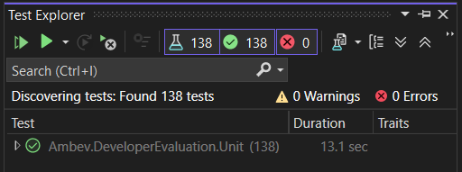

# Developer Store

## Descrição

Este projeto é uma API Web desenvolvida em .NET 8, projetada para gerenciar operações relacionadas a vendas, produtos, usuários, autenticação e carrinhos. Ele serve como uma base para avaliação de desenvolvedores, demonstrando boas práticas de desenvolvimento, testes unitários e organização de código.

## Funcionalidades

- **Gerenciamento de Vendas**: Criação, atualização, exclusão e consulta de vendas.
- **Gerenciamento de Produtos**: Consulta de produtos com suporte a paginação.
- **Gerenciamento de Usuários**: Consulta de informações de usuários.
- **Autenticação**: Gerenciamento de autenticação e autorização.
- **Carrinhos de Compras**: Criação e manipulação de carrinhos.

## Tecnologias Utilizadas

- **.NET 8**
- **ASP.NET Core** para construção da API.
- **Docker & Docker Compose**
- **PostgreSQL** (Banco relacional)
- **MongoDB** (NoSQL)
- **Redis** (Cache)
- **FluentValidation** (Validações)
- **AutoMapper** (Mapeamento de Objetos)
- **MediatR** (Mediador)
- **XUnit, NSubstitute e Faker** (Testes unitários e mocks)
- **Rebus** (Mensageria)

## **Como Executar o Projeto**

Nessa [página](./doc/Getting-Started.md) você encontrará as informações necessárias para configurar e executar o projeto.

## Como Utilizar

### Visão geral

- Todos os endpoints necessitam autorização, com excessão dos endpoints de autenticação e de criação de usuário.

- Os endpoints de produtos só poderão ser por usuários que pertencam a função _Admin_ ou _Manager_.

- Usuários com a função _Customer_ só poderão consultar e alterar seus registros.

- Os endpoints de pesquisa paginada permitem que a consulta contenha filtros, que devem seguir as seguintes orientações

  - `field=value`: pesquisa o campo pelo valor informado

    Exemplo:

    ```
    GET /products?category=men's clothing&price=109.95
    ```

  - **Campo texto**

    Para filtrar correspondências parciais em campos de texto, use um asterisco (\*) antes ou depois do valor.

    Exemplo:

    ```
    GET /products?title=Fjallraven*
    GET /products?category=*clothing
    ```

  - **Campos numéricos e de data**

    Para filtrar campos numéricos ou de data por intervalo, use os prefixos \_min (maior ou igual) e \_max (menor ou igual) antes do nome do campo.

    Exemplo:

    ```
    GET /products?_minPrice=50
    GET /products?_minPrice=50&_maxPrice=200
    GET /carts?_minDate=2023-01-01
    ```

  - **Operadores lógicos**

    Ao combinar filtros, utilize `&` entre eles.

    Exemplo:

    ```
    GET /products?category=men's clothing&_minPrice=50
    GET /products?title=Fjallraven*&category=men's clothing&_minPrice=100
    ```

### Endpoints Principais

- [Auth (Autenticação)](./doc/Auth.md)
- [Carrinho (Cart)](./doc/Cart.md)
- [Products (Produtos)](./doc/Products.md)
- [Sales (Sale)](./doc/Sale.md)
- [Users (Usuários)](./doc/User.md)

## Testes

Para executar os testes:

- Via terminal de comando, na pasta raiz do projeto, execute:

```Bash
dotnet test tests/Ambev.DeveloperEvaluation.Unit
dotnet test tests/Ambev.DeveloperEvaluation.Integration
dotnet test tests/Ambev.DeveloperEvaluation.Functional
```

Ou

- Utilizando o Visual Studio, abre a tela do Test Explorer (Ctrl+E, T)


