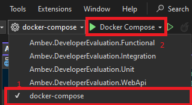

# Como executar

###### [Página inicial](../README.md)

Este guia fornece uma passo-a-passo para configurar e executar o projeto localmente.

## **Pré-requisitos**

Certifique-se de que os seguintes softwares estejam instalados no seu computador:

1. [.NET 8 SDK](https://dotnet.microsoft.com/download/dotnet/8.0)
2. [Docker](https://www.docker.com/)
3. [Docker Compose](https://docs.docker.com/compose/install/)
4. Editor de código (ex: [Visual Studio](https://visualstudio.microsoft.com/vs/community/))
5. [Git](https://git-scm.com/downloads)

### Step 1: Clonar o repositório

Clone o repositório do GitHub:

```bash
git clone https://github.com/leovictorcvo/developer-store.git
```

### Step 2: Verificar se as portas necessárias estão livres

O projeto utiliza o Docker Compose para gerenciar os serviços (API, PostgreSQL, MongoDb, Redis). Para evitar conflitos ao iniciar o projeto, verifique se as portas abaixo estão disponíveis:

- 8080, 8081 (API)
- 5432 (PostgreSQL)
- 27017 (MongoDb)
- 6379 (Redis)
- 8085 (NgInx)

Check for port availability:

```
netstat -an | findstr "8080 8081 5432 27017 6379 8085"
```

Se uma dessas portas estiverem sendo utilizadas, pare o serviço que está conflitando ou modifique as portas no docker-compose.yml localizado na raiz do projeto.

### Step 3: Inicie o Docker Desktop

### Step 4: Suba os serviços no Docker:

- Abre um terminal na pasta raiz do projeto e tilize o comando _docker compose_

```bash
docker compose up --build
```

Dessa forma o Swagger estará disponível no endereço: _http://localhost:8085/swagger/index.html_

Ou

- Através do Visual Studio



Dessa forma a página contendo o Swagger abrirá ao iniciar o projeto

**Observação:** Não é necessário executar o comando `dotnet ef database update` para criar as tabelas no banco pois as migrations já estão sendo aplicadas ao iniciar o projeto.
